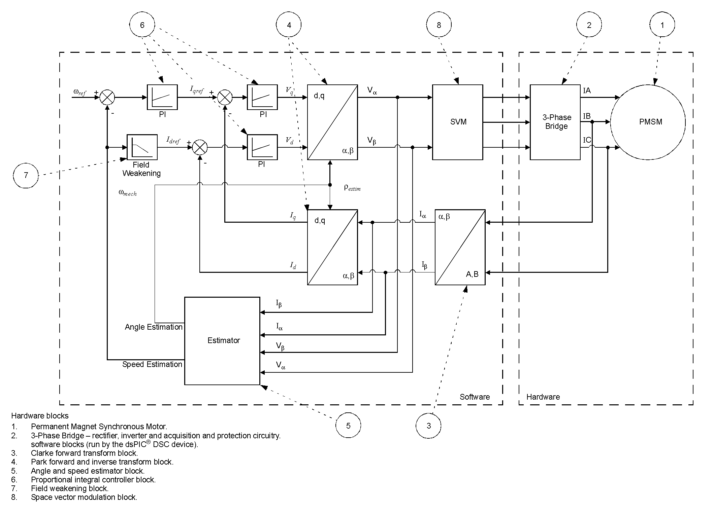

 

## AN1292 ON MCLV-48V-300W INVERTER BOARD

## 1. INTRODUCTION

This document describes on the application note AN1292 “Sensorless Field Oriented Control (FOC) for a Permanent Magnet Synchronous Motor (PMSM) Using a PLL Estimator and Field Weakening (FW)” using MCLV-48V-300W Inverter Board. 

## 2. AN1292 Application Note

Current industry trends suggest the Permanent Magnet Synchronous Motor (PMSM) as the first preference for motor control application designers. Its strengths, such as high power density, fast dynamic response and high efficiency in comparison with other motors in its category, coupled with decreased manufacturing costs and improved magnetic properties, make the PMSM a good recommendation for large-scale product implementation.

Microchip Technology produces a wide range of Digital Signal Controllers (DSCs) for enabling efficient, robust and versatile control of all types of motors, along with reference designs of the necessary tool sets, resulting in a fast learning curve and a shortened development cycle for new products. 

The intent of the application note AN1292 is to present sensorless Field Oriented Control (FOC) of a three-phase PMSM using a PLL estimator and Field Weakening. 

For more information on this application note [click here](https://www.microchip.com/en-us/application-notes/an1292)

## 3. MCLV-48V-300W Inverter Board

The Motor Control System (MCS) Development Tool Ecosystem enables you to rapidly develop motor control designs using the dsPIC® DSCs, SAM, PIC32MK, PIC32MC and PIC32C MCUs. The MCS Development Tools consist of modular and interchangeable inverter boards, controller boards (Dual In-Line Modules or DIMs) and expansion boards. The Motor Control Low-Voltage 48V-300W Inverter Board is targeted to drive a low-voltage three-phase Permanent Magnet Synchronous Motor or Brushless DC  motor (PMSM/BLDC motor).

The MCLV-48V-300W Inverter Board requires a compatible DIM to be inserted on the board to run the motors.

They are various DIM's available with various dsPIC DSC's available from Microchip. The user can select the DIM for particular DSC and it can be used to run the AN1292 code. The links for various dsPIC DSC's code examples on AN1292 are provided in the next section.

## Links for the AN1292 code examples using MCLV-48V-300W Inverter Board and different dsPIC DSC's:

1. dsPIC33CK256MP508 dsPIC DSC - [MCLV-48V-300W dsPIC33CK256MP508 AN1292](https://mplab-discover.microchip.com/v1/item/com.microchip.ide.project/com.microchip.subcategories.motor-control-and-drive.motor-types.permanent-magnet-syncrhonous-motor-pmsm/com.microchip.mplabx.project.mclv-48v-300w-an1292-dspic33ck256mp508/1.0.0?view=about)

2. dsPIC33CH512MP508 dsPIC DSC - [MCLV-48V-300W dsPIC33CH512MP508 AN1292](https://mplab-discover.microchip.com/v1/item/com.microchip.ide.project/com.microchip.subcategories.motor-control-and-drive.motor-types.permanent-magnet-syncrhonous-motor-pmsm/com.microchip.mplabx.project.mclv-48v-300w-an1292-dspic33ch512mp508/1.0.0?view=about)