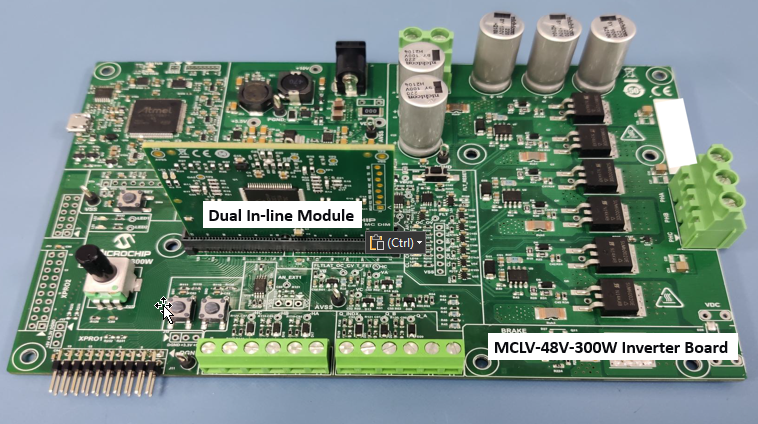

 

## AN1292 Code Examples : MCLV-48V-300W Inverter Board 

This site hosts AN1292 code examples for different dsPIC DSC families using the MCLV-48V-300W Inverter Board.

The various dsPIC™ DSC families can be used to demonstrate and develop motor control applications using the MCLV-48V-300W Inverter Board by plugging in a specific Motor Control Dual In-Line Modules (DIMs). Motor Control DIMs are controller boards that embed a dsPIC DSC or Microcontroller designed to evaluate motor control applications. The table summarizes Device, DIM, and links to the source code for easy access. 

| Device |Dual In-Line Module|Source Code |
| :----------| :----|:----|
| dsPIC33CK256MP508|dsPIC33CK256MP508| https://mplab-discover.microchip.com/v1/item/com.microchip.ide.project/com.microchip.subcategories.modules-and-peripherals.analog.adc-modules.adc/com.microchip.mplabx.project.mclv-48v-300w-an1292-dspic33ck256mp508/1.0.0?view=about    |
| dsPIC33CH512MP508 | dsPIC33CH512MP508 | https://mplab-discover.microchip.com/v1/item/com.microchip.ide.project/com.microchip.subcategories.modules-and-peripherals.analog.adc-modules.adc/com.microchip.mplabx.project.mclv-48v-300w-an1292-dspic33ch512mp508/1.0.0?view=about|

 

